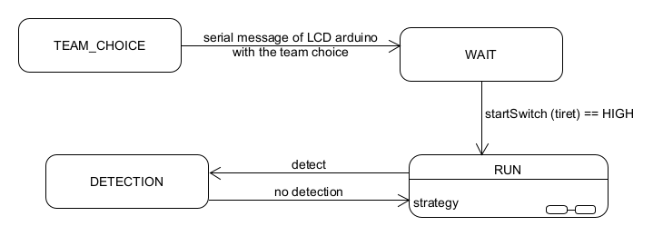
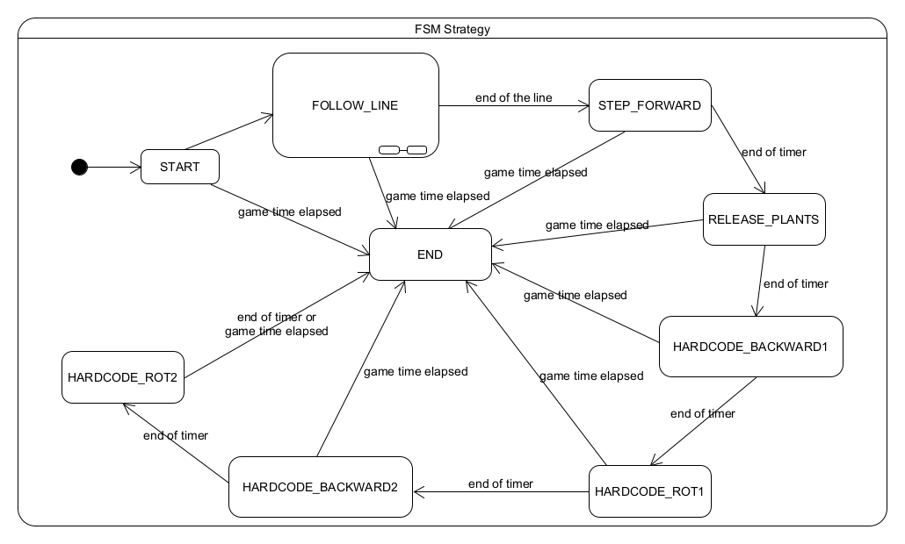
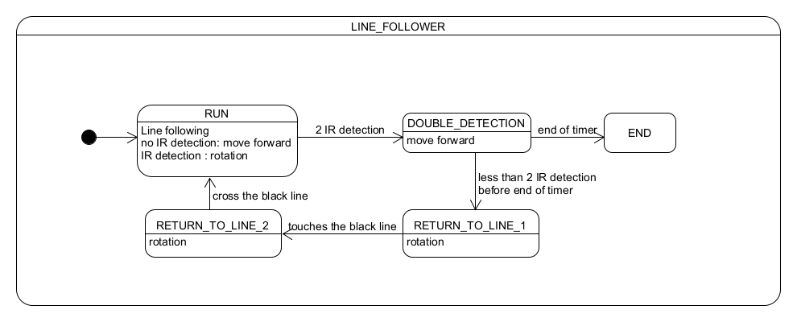

# BeeBot

# Table of contents

* [Project participants](#project-participants)
* [About the project](#question-about-the-project)
* [Getting started](#rocket-getting-started)
    * [Frameworks](#zap-frameworks)
    * [Class diagram](#seedling-class-diagram)
    * [state machine](#seedling-great-robot-state-machine)
## **Project participants**

### 2023-24

- FRANÇOIS Thibaut
- JOEL Thierry
- MAILLARD Corentin
- REYES LOVERANES Stéphanie
- THIBAUT Corentin
- VAN BOGAERT Emilie

## :question: About the project

The purpose of this project is create a robot that will be able to take the plants and put them in a greenhousse before going to the last greenhouse to "recharge" the robot.

## :rocket: Getting started

### :zap: Library
All these libraries can be installed with the arduino IDE library manager.

For the TFT LCD:
- MCUFRIEND_kbv by David Prentice
- Adafruit TouchScreen by Adafruit

For Motor driver:
- Adafruit Motor Shield V2 by Adafruit

For the Log:
- ArduinoLog by Thijs Elenbaas

For Unit test:
- AUnit by Brian T.Park

### :seedling: class diagram

### :seedling: Great Robot state machine

#### state of the "Main"

#### state of the "Strategy"

#### state of the "LineFollower"

