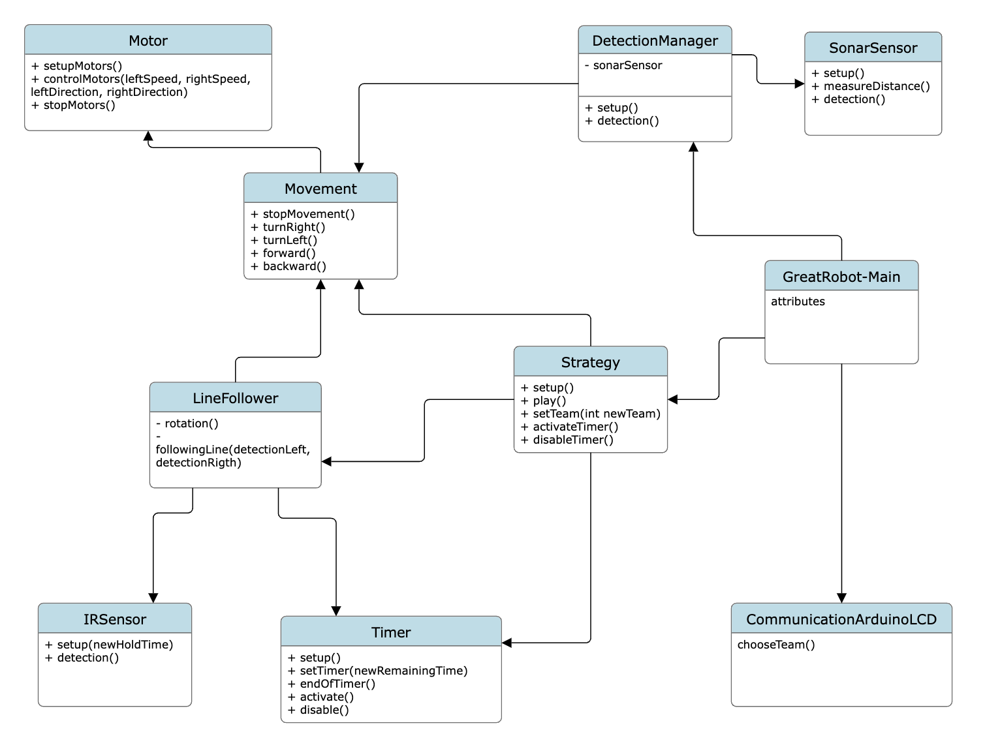

# BeeBot

# Table of contents

* [Project participants](#project-participants)
* [About the project](#question-about-the-project)
* [Getting started](#rocket-getting-started)
    * [Frameworks](#zap-frameworks)
    * [Class diagram](#class-diagram)
## **Project participants**

### 2023-24

- FRANÇOIS Thibaut
- JOEL Thierry
- MAILLARD Corentin
- REYES LOVERANES Stéphanie
- THIBAUT Corentin
- VAN BOGAERT Emilie

## :question: About the project

The purpose of this project is create a robot that will be able to rotate the solar pannel.

## :rocket: Getting started

### :zap: Library

For the TFT LCD
- MCUFRIEND_kbv

### class diagram

