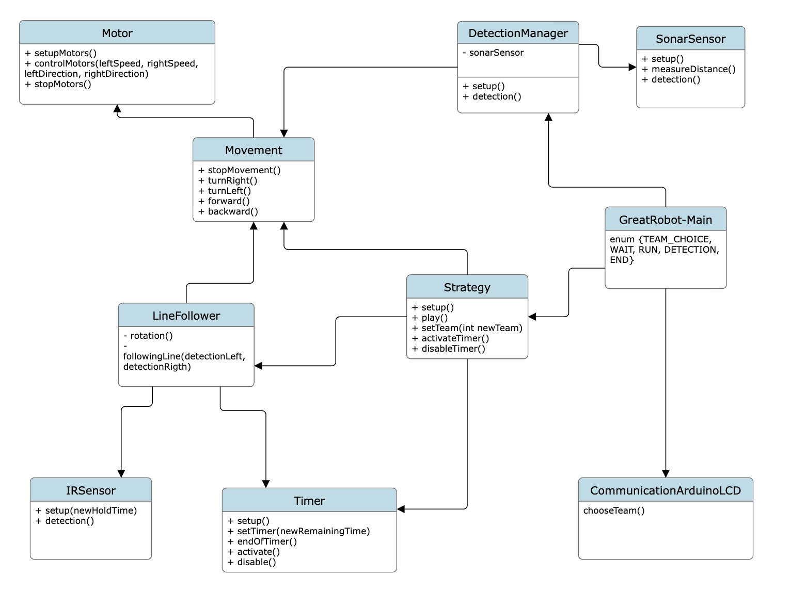

# BeeBot

# Table of contents

* [Project participants](#project-participants)
* [About the project](#question-about-the-project)
* [Getting started](#rocket-getting-started)
    * [Frameworks](#zap-frameworks)
    * [Class diagram](#seedling-class-diagram)
    * [state machine](#seedling-great-robot-state-machine)
    * [unit test](#unit-test)
## **Project participants**

### 2023-24

- FRANÇOIS Thibaut
- JOEL Thierry
- MAILLARD Corentin
- REYES LOVERANES Stéphanie
- THIBAUT Corentin
- VAN BOGAERT Emilie

## :question: About the project

This project was made as part of the eurobot 2024 competition.
The purpose of this project is create a robot that will be able to take the plants and put them in a greenhousse before going to the last greenhouse to "recharge" the robot.
This robot will also be accompanied by 2 PAMI (PAMI-ONE and PAMI-TWO).

## :rocket: Getting started

### :zap: Library
All these libraries can be installed with the arduino IDE library manager.

For the TFT LCD:
- MCUFRIEND_kbv by David Prentice
- Adafruit TouchScreen by Adafruit

For Motor driver:
- Adafruit Motor Shield V2 by Adafruit

For the Log:
- ArduinoLog by Thijs Elenbaas

For Unit test:
- AUnit by Brian T.Park

### :seedling: class diagram

### :seedling: Great Robot state machine

#### state of the "Main"

#### state of the "Strategy"

#### state of the "LineFollower"

### unit test

The unit test can be performed directly on an Arduino board. It is uploaded to the board just like classic arduino code. The result of the unit test will be sent by serial.

unit test :[here](GreatRobot\unit-tests)

troubleshooting: during compilation, it may not see the class file to be tested. This can be resolved by replacing the relative path with its absolute path (for the "include"). 