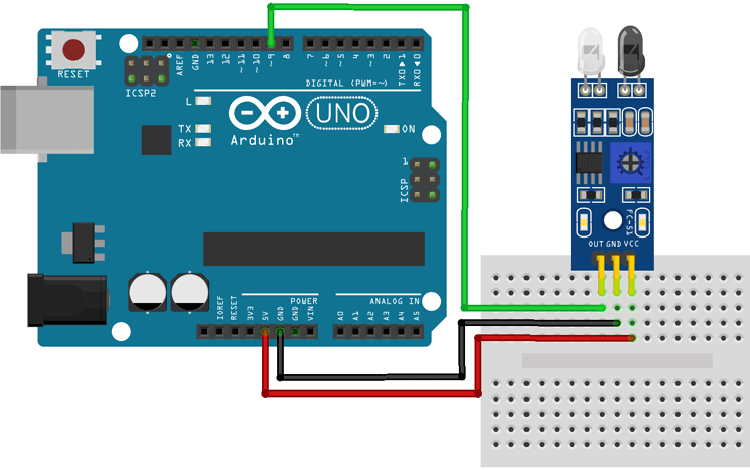
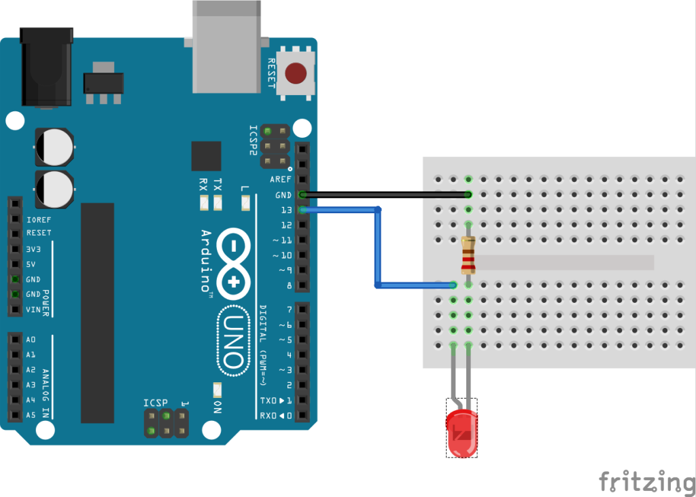

# Utilisation des Capteurs Infrarouges pour le Suivi de Ligne

## Introduction
> Ce rapport se concentre sur l'utilisation des capteurs infrarouges (IR) pour la détection et le suivi de ligne dans le cadre du projet de robotique. Les LEDs sont intégrées aux capteurs IR pour augmenter la précision de détection de la ligne.

## Matériel utilisé

- Microcontrôleur :
  - Arduino Uno 
- Capteurs Infrarouges (IR) :
  - 2 capteurs infrarouges pour la détection de ligne.
- LEDs :
  - 2 LEDs blanches pour améliorer la détection
- Résistances :
  - Résistances pour les LEDs (par exemple, 220 ohms)
- Câbles de connexion :
  - Câbles pour connecter les capteurs IR, les LEDs et le microcontrôleur
- Plaque d'essai (Breadboard) :
  - Pour les connexions temporaires et les tests
- Alimentation :
  - Source d'alimentation pour le microcontrôleur.


## Schéma de Câblage

Les capteurs IR sont connectés aux broches numériques de la carte Arduino. Les LEDs sont placées à proximité des capteurs pour améliorer la précision de détection en éclairant la ligne.
1. Capteurs Infrarouges :
  - IR gauche connecté à la broche numérique 9.
  - IR droit connecté à la broche numérique 10.
2. LEDs :
  - Les LEDs sont connectées en parallèle aux capteurs IR, alimentées via les mêmes broches pour synchroniser l'éclairage avec la détection.
Les images ci-dessous montrent les connexions des capteurs IR et des LEDs à l'Arduino :



_Figure 1: Connexion du capteur IR à l'Arduino_


_Figure 2: Connexion des LEDs à l'Arduino._
- _Notons ici que nous n'avons pas besoin de manipuler l'etat des leds dans le cadre de ce projetpar conséquent elles seront directement mises sur les bornes positive et négative._

## Explication du code 
### Déclaration des Broches et des Instances de Classes
> Dans le fichier principal GreatRobot-Main.ino, nous avons les broches pour les capteurs IR et les instances des classes nécessaires pour gérer la détection sont définies.
```cpp
// DEFINE PINS
const int IR_left_PIN = 9;
const int IR_right_PIN = 10;
// DEFINE INSTANCES FOR CLASSES
LineFollower lineFollower = LineFollower(IR_left_PIN, IR_right_PIN);
```
### Configuration des Capteurs Infrarouges
La fonction `setup()` initialise les capteurs IR et configure les broches correspondantes.
```cpp
void setup() {
  lineFollower.setup();
  Serial.begin(9600);
}
```
### Classe IRSensor
Dans le fichier **IRSensor.h**, nous avons la classe `IRSensor` qui gère la configuration et la détection pour un capteur IR individuel.
```cpp
class IRSensor {
public:
    IRSensor(int Pin);
    void setup(unsigned long newHoldTime);
    bool detection();
    void setHoldTime(int newHoldTime);

private:
    int pin;
    unsigned long timeLastDetection;
    unsigned int holdTime;
    bool val_detect;
};
```
Dans le fichier **IRSensor.cpp**, nous définissons un constructeur de la classe qui initialise la broche du capteur IR.
```cpp
// Constructeur de la classe
IRSensor::IRSensor(int Pin) {
  pin = Pin;
}
```
**void IRSensor::setup(unsigned long newHoldTime) :** Méthode pour configurer la broche du capteur IR et initialiser le temps de maintien
```cpp
void IRSensor::setup(unsigned long newHoldTime) {
  pinMode(pin, INPUT);
  timeLastDetection = 0;
  holdTime = newHoldTime;
}
```
**bool IRSensor::detection():** Méthode pour détecter la présence de la ligne. Si une detection est faite, ‘val_detect’ est mis à jour et le temps de la dernière détection est mise à jour
```cpp
bool IRSensor::detection() {
  bool detection = (digitalRead(pin) == HIGH);
  if (detection) {
    val_detect = true;
    timeLastDetection = millis();
  } else if (val_detect && millis() - timeLastDetection > holdTime) {
    val_detect = false;
  }
  return val_detect;
}
```
**void IRSensor::setHoldTime(int newHoldTime) :** Méthode pour définir le temps de maintien
```cpp
void IRSensor::setHoldTime(int newHoldTime) {
  holdTime = newHoldTime;
}
```

### Classe LineFollower
Dans les fichiers LineFollower, la classe `LineFollower` utilise deux instances de `IRSensor` pour suivre la ligne.
```cpp
class LineFollower {
public:
  LineFollower(int IR_left_pin, int IR_right_pin);
  bool followingLine();
  void setup();
  void setTeam(int team);

private:
  IRSensor IRsensorLeft;
  IRSensor IRsensorRight;
  void followingLine_RUN(bool detectionLeft, bool detectionRigth);
};
```
**LineFollower::LineFollower(int IR_left_pin, int IR_right_pin) :** Constructeur de la classe qui initialize les capteurs IR gauche et droit.
```cpp
LineFollower::LineFollower(int IR_left_pin, int IR_right_pin)
: IRsensorLeft(IR_left_pin), IRsensorRight(IR_right_pin) {}
```
**void LineFollower::setup() :** Méthode pour configurer les capteurs IR
```cpp
void LineFollower::setup() {
  IRsensorLeft.setup(0);
  IRsensorRight.setup(0);
}
```
**bool LineFollower::followingLine() :**  Méthode principale pour suivre la ligne. Elle appelle ‘followingLine_RUN’ pour adjuster la direction du robot en fonction des detections des capteurs.
```cpp
bool LineFollower::followingLine() {
  bool detectionLeft = IRsensorLeft.detection();
  bool detectionRigth = IRsensorRight.detection();
  followingLine_RUN(detectionLeft, detectionRigth);
  return false;
}
```
**void LineFollower::followingLine_RUN(bool detectionLeft, bool detectionRigth):** Méthode pour ajuster la direction du robot en function des detections des capteurs. Si les deux capteurs détectent la ligne, le robot avance. Si un seul capteur détecte la ligne, le robot tourne dans la direction appropriée.
```cpp
void LineFollower::followingLine_RUN(bool detectionLeft, bool detectionRigth) {
  if (detectionLeft && detectionRigth) {
    Movement::forward();
  } else if (detectionLeft) {
    Movement::turnLeft();
  } else if (detectionRigth) {
    Movement::turnRight();
  } else {
    Movement::forward();
  }
}
```

## Conclusion
>Les capteurs infrarouges jouent un rôle crucial dans le suivi de ligne pour le robot. En plaçant des LEDs avec les capteurs IR, la précision de la détection de la ligne est améliorée, ce qui permet au robot de suivre plus efficacement et avec une meilleure réactivité. Le code décrit comment configurer et utiliser ces capteurs pour un suivi de ligne précis. La classe **Strategy** orchestre les différentes de déplacement du robot en fonction de la stratégie de jeu définie, assurant un comportement cohérent et optimisé pour la tâche à accomplir.