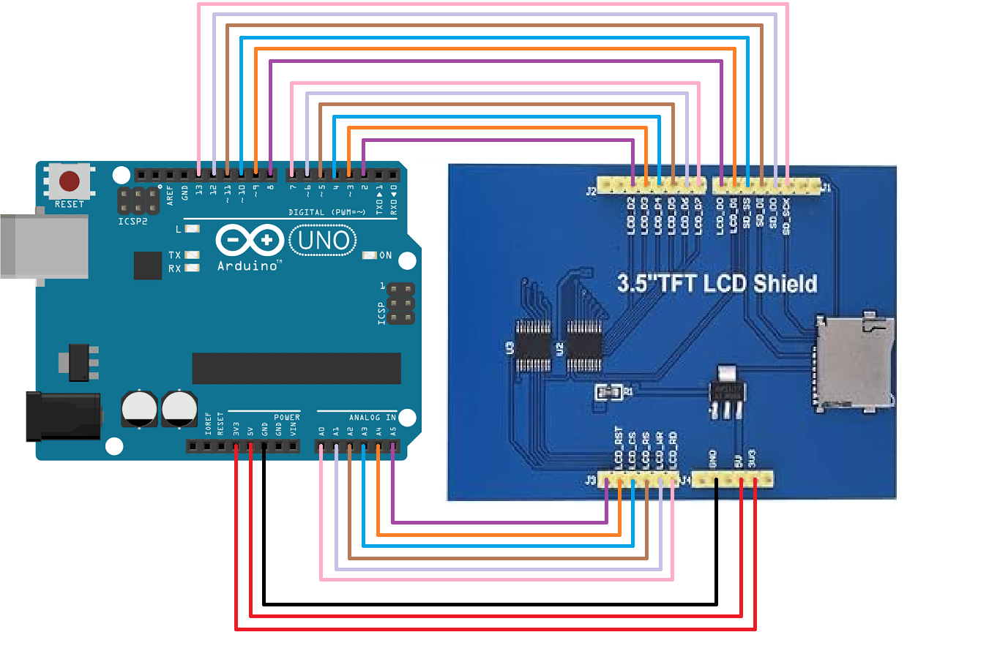

# Communication entre un Arduino et un tft lcd shield, en Serial entre Arduino et Arduino

Ce projet démontre comment établir une communication Serial entre un Arduino et un Arduino. Ainsi qu'un câblage et un code simple pour faire fonctionner un tft lcd shield.

## Matériel nécessaire

- 2x Arduino
- 1x tft lcd shield
- Câbles de connexion

## Connexions matérielles Arduino et LCD



## Code pour le tft lcd shield

A mettre sur un arduino le code ecran_lcd_simple_code. La description du code est en commentaire directement dans le code

## Connexions en Serial entre 2 Arduino

Si vous voulez communiquer avec un autre Arduino (car le premier shield n’a plus de place après avoir brancher le LCD). Il faudra faire une communication en Serial avec les pins Tx et Rx qu’il faut brancher en les croisant cad Rx (Arduino 1) relié à Tx (Arduino 2) et Tx (Arduino 1) relié à Rx (Arduino 2).

## Commande pour communiquer en Serial

De base le TFT va désactiver la communication en Serial donc a chaque fois que vous voulez envoyer un message sur l’Arduino principal ou recevoir un message de l’Arduino principal, il faudra réactiver le Serial avec la commande:

```cpp
Serial.begin(9600);
//if we want to send a message to the main Arduino
Serial.print("message");
//check if serial available
if(Serial.available()){
  //to read what the main Arduino send
	String serialStr = Serial.readString();
}
//We finish communicating before using a tft command
//otherwise the tft can make the code crash with the Serial still active
Serial.end();

```
